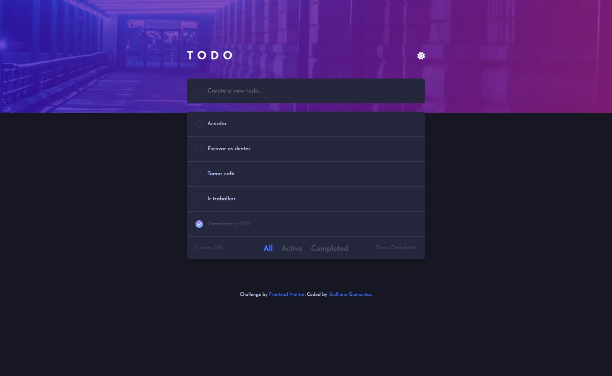
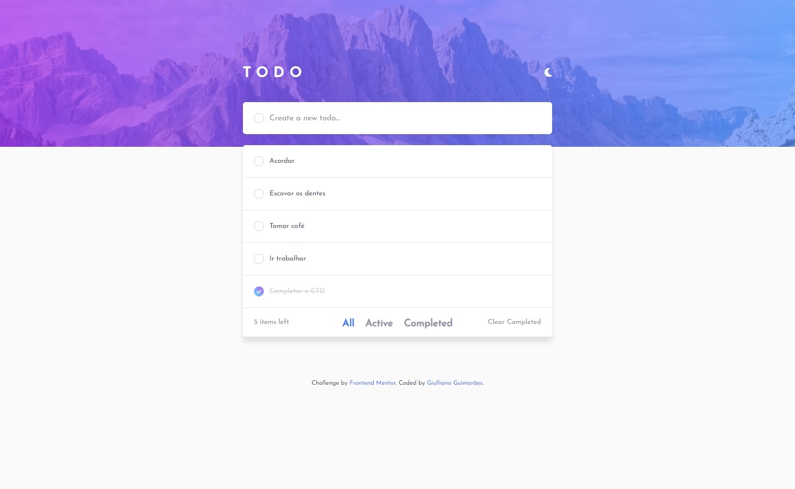
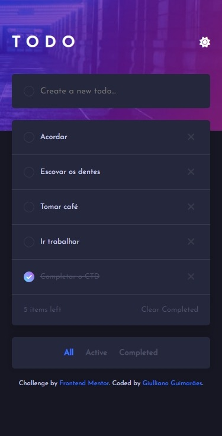

# Todo App com JS puro

Este é um desafio do Frontend Mentor que consiste em um app gerenciador de lista de tarefas (todo list).

Nesse app, você cadastra tarefas, marca como completae deleta uma tarefa, além de filtrar entre tarefas completas e ativas.

## Layout

*Captura de tela em 1440px - Desktop*

---

*Captura de tela em 1440px - Desktop - Tema claro*

---

*Captura de tela em 375px - Mobile*

Confira o deploy: [https://todo-app-chi-one.vercel.app](https://todo-app-chi-one.vercel.app)

## Ferramentas e Tecnologias

O projeto foi montado utilizando o Visual Studio Code, com as seguintes tecnologias:

- HTML5
- CSS3
- JavaScript
- Sass

## Instalação

Caso queira baixar e instalar os arquivos no seu computador e visualizar o projeto:

- Abra o projeto com Visual Studio Code.
- Instale as extensões Live Server e Live Sass Compiler.